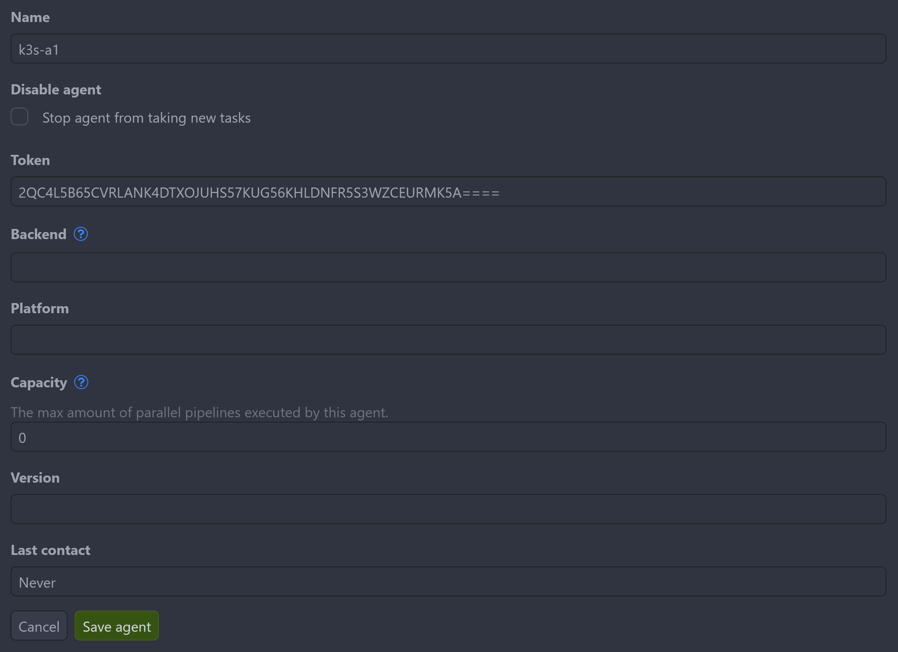

## General

Crow consists out of essential components (the "server" and the "agent") and an optional one (the "autoscaler").

The **server** provides the UI, handles webhook requests to the underlying forge, serves the API and parses the pipeline configurations from the YAML files.

The **agent** executes the pipelines using a specific backend (`docker`, `kubernetes`, `local`) and connects to the server via GRPC.
Multiple agents can coexist besides each other, allowing to fine-tune job limits, backend choice and other agent-related settings for a single instance.

The **autoscaler** allows spinning up new VMs on a cloud provider of choice to process pending builds.
After the builds finished, the VMs are destroyed again (after a short transition time).

Crow ships and uses a SQLite DB by default.
For larger instances it is recommended to use it with a Postgres or MariaDB instance.[^2]

!!! note

    The deployment of an external database is not covered here. There are many existing public guides for deploying databases. An alternative option is to use a managed DB service from a Cloud provider. If you are unsure what you need and if Crow is a good fit for you in general, you can also proceed with the SQLite DB first and decide later.

There are currently two official ways[^1] how to install Crow:

- Via [`docker-compose`](docker-compose.md) for single servers.
- Via [`helm`](helm.md) for Kubernetes.

## Crow agent secret

To allow secure communication between the _server_ and _agent_ via GRPC, a token is required.

There are two ways types of tokens:

- System token
- Agent token

When using the Helm chart, a Kubernetes secret containing an agent token is created automatically.
This token is then used by all agents which have access to this secret.
In the best case, no further configuration is required.

### System token

The system token is set via the env var `CROW_AGENT_SECRET` for both server and agent.
**There can only ever be one system token at the same time, therefore.**

If a system token is set, the registration process is as follows:

1. The first time the agent communicates with the server, it is using the system token
2. The server registers the agent in its database and generates a unique ID which is then sent back to the agent
3. The agent stores the received ID in a config file (path is defined by `CROW_AGENT_CONFIG_FILE`)
4. At the subsequent starts of the agent, it uses this token and its received ID to identify itself to the server

!!! info

    If the ID is not stored/persisted in `CROW_AGENT_CONFIG_FILE` and the agent connects with a matching agent token, a new agent is registered in the DB and the UI.
    This will happen every time the agent container is restarted.
    While this is not an issue at runtime, the list of registered agents will grow and leave behind "zombie" agents which are registered in the DB but not active anymore.
    It is therefore recommended to persist `CROW_AGENT_CONFIG_FILE` to ensure idempotent agent registrations.

### Agent token

Agent tokens are created in the UI of the server (`Settings -> Agents -> Add agent`).
This is an alternative way to tell the server about persistent agents and their possible connections.

Agent tokens can be handed over to individual agents via `crow_AGENT_SECRET`, making it possible to register additional unique agents.

{ width="500", loading=lazy }
/// caption
Registration of a new agent through UI
///

[^2]: This is primarily because Crow (still) stores pipeline logs in the DB. A refactoring to storing these outside the DB by default is planned but now yet implemented.

## Image tags

!!!info

    No `latest` tag exists to prevent accidental major version upgrades.
    Either use a Semver tag or one of the rolling major/minor version tags.
    Alternatively, the `dev` tag can be used for rolling builds from the `main` branch.

- `vX.Y.Z`: SemVer tags for specific releases, no entrypoint shell (scratch image)
    - `vX.Y`
    - `vX`
- `vX.Y.Z-alpine`: SemVer tags for specific releases, rootless for Server and CLI
    - `vX.Y-alpine`
    - `vX-alpine`
- `dev`: Built from the `main` branch
    - `dev-<hash>`
- `pull_<PR_ID>`: Images built from Pull Request branches.

## Image registries

Images are currently solely provided through the GitHub Container Registry (ghcr.io).

!!!info

    If there funds available to cover a DockerHub team subscription, images will also be there.

- [crow-server (ghcr.io)](https://github.com/crowci/crow/pkgs/container/crow-server)

- [crow-agent (ghcr.io)](https://github.com/crowci/crow/pkgs/container/crow-agent)

- [crow-cli (ghcr.io)](https://github.com/crowci/crow/pkgs/container/crow-cli)

- [crow-autoscaler (ghcr.io)](https://github.com/crowci/crow/pkgs/container/crow-autoscaler)

[^1]: An Ansible role is in the works.
